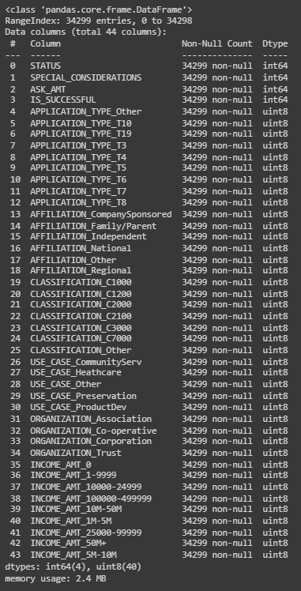
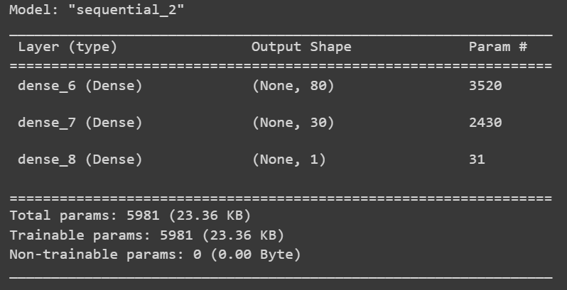
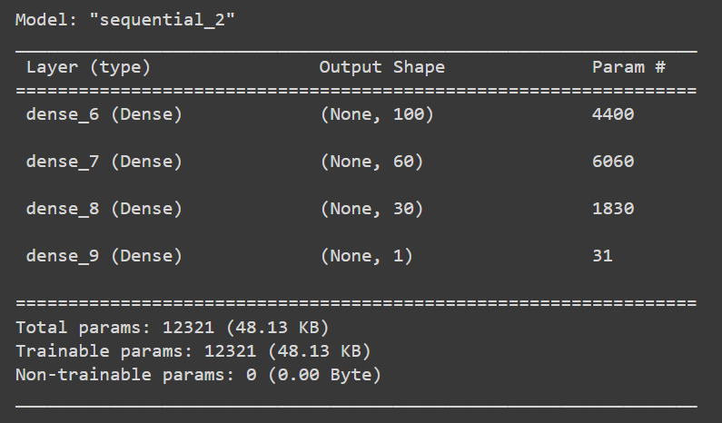
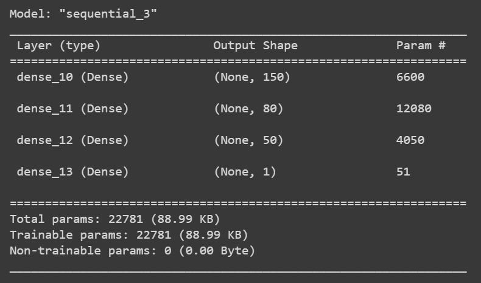
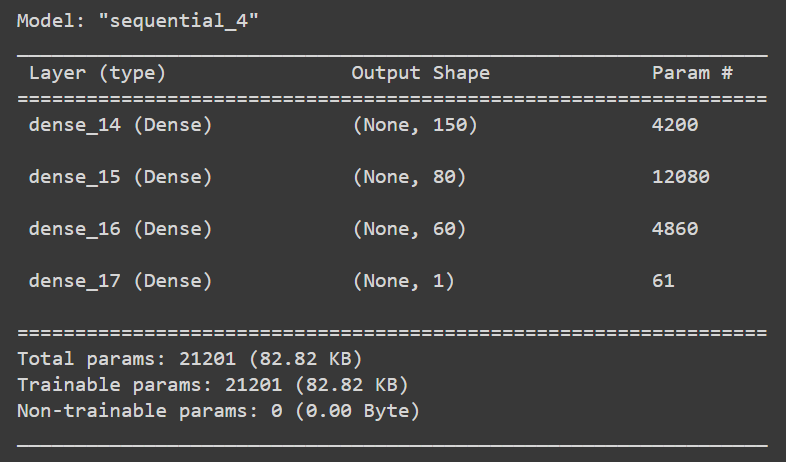
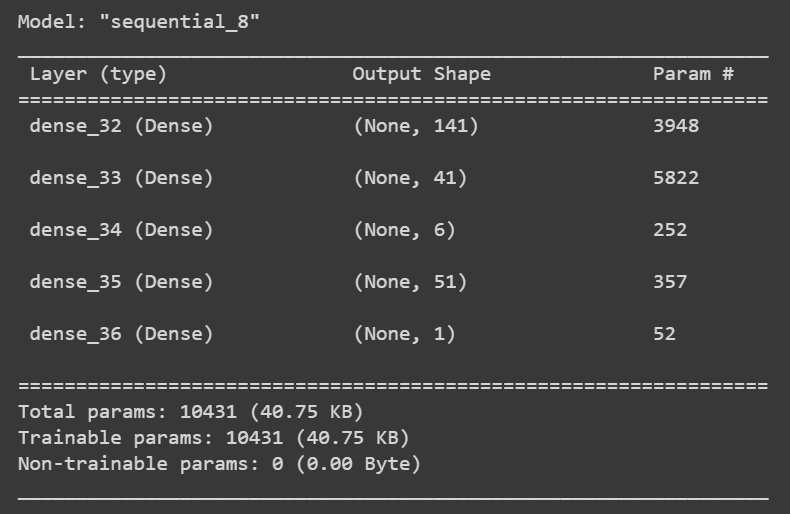

# Module 21: Alphabet Soup Deep Learning Report

## Overview of the Analysis

### Objective
The nonprofit foundation Alphabet Soup wants a tool that can help it select the applicants for funding with the best chance of success in their ventures. The purpose of this analysis is to use deep learning and neural networks to predict if applicants will be successful if funded by Alphabet Soup.

### The Data
There are 34,229 rows of data. The columns include the following:

 - EIN and NAME—Identification columns
 - APPLICATION_TYPE—Alphabet Soup application type
 - AFFILIATION—Affiliated sector of industry
 - CLASSIFICATION—Government organization classification
 - USE_CASE—Use case for funding
 - ORGANIZATION—Organization type
 - STATUS—Active status
 - INCOME_AMT—Income classification
 - SPECIAL_CONSIDERATIONS—Special considerations for application
 - ASK_AMT—Funding amount requested
 - IS_SUCCESSFUL—Was the money used effectively

## Results 

### Data Preprocessing

**What variable(s) are the target(s) for your model?**

The target for our model is IS_SUCCESSFUL, a binary classifier that is 1 if the organization is successful and 0 if not.

**What variable(s) are the features for your model?**

The features for our model include:
- APPLICATION_TYPE: A categorical value for which we created a cutoff point to bin "rare" categorical variables together in a new value, Other and then proceeded to one-hot encode.         
- AFFILIATION: A categorical value that we one-hot encode.                 
- CLASSIFICATION: A categorical value for which we created a cutoff point to bin "rare" categorical variables together in a new value, Other.              
- USE_CASE: A categorical value that we one-hot encode.                           
- ORGANIZATION: A categorical value that we one-hot encode.                       
- STATUS: A categorical value that we one-hot encode.                             
- INCOME_AMT: The income amount is displayed in bins and is thus a categorical value that we one-hot encode.                         
- SPECIAL_CONSIDERATIONS: A binary value with Y/N values. We used binary encoding to map Y/N to 1/0.     
- ASK_AMT: A float value.

All feature columns were split into training and testing values, and then scaled based on the training data using StandardScaler.

**What variable(s) should be removed from the input data because they are neither targets nor features?**

We remove the EIN and NAME columns as they are identification values.

### Compiling, Training, and Evaluating the Model

**How many neurons, layers, and activation functions did you select for your neural network model, and why?**

The initial model had:

- 43 input features, after making all the features numberical values.
- 2 hidden layers, to add some complexity to the model.
- Layer 1 had 80 neurons, a number that was chosen as approximately two times the number of input features. This is a common tule of thumb.
- 100 epochs
- Layer 2 had 30 neurons. I chose this value as I wanted to lower the number of nodes which each layer
- Activation function was 'relu' for the hidden layers. ReLU stands for Rectified Linear Unit, and it was chosed as it is one of the most commonly used activation functions in artificial neural networks, including deep learning models. The ReLU activation function is used to introduce non-linearity into a neural network.
- The output layer had activation function 'sigmoid'. The sigmoid function, also known as the logistic function, is a popular activation function used in machine learning and artificial neural networks. It maps any real-valued number to a value between 0 and 1. I used it as we are aiming to predict a classifier with values 1 or 0. 

**Were you able to achieve the target model performance?**

The target accuracy was established at 75%, The intial model did not meet this mark, with an accuracy score on the testing data of 72.78%. This meant my model hyperparametres needed to be tuned.

**What steps did you take in your attempts to increase model performance?**

Attempt 1:

1. Remove Outliers, by removing any rows where scaled any value of |X_train_scaled| > 3
2. Adding a hidden layer
3. Increasing no. of neurons to 100, 60, and 30 respectively
4. Increasing no. of epochs to 150

I removed outliers with the intention to reduce noise that might be misdirecting my model. I chose 3 as the threshold as all the values are scaled to be a z_score. A z-score of 3 means that the data point is three standard deviations away from the mean. This threshold is often used in statistics as a rule of thumb to identify extreme outliers, as data points that are three standard deviations away from the mean are relatively rare in a normal distribution. The no. of rows fed into the model went down to 13,374 after removing rows with any outliers.

I added a hidden layer. I did this as using three hidden layers in a TensorFlow (TF) model often appears in neural network architectures because it provides a balance between model complexity and capacity.

I increased the no. of nodes and epochs in an attempt to increase complexity and no. of trials.

This model had a testing accuracy of 62.5% which is worse than the initial model.

Attempt 2:

1. Keeping 3 hidden layers
2. Increasing no. of neurons to 150, 80, and 50 respectively
3. Keeping no. of epochs to 150
4. Change activation function to tanh

Removing the outliers did not seem to work, so in my next attempt I increased the number of nodes in each layer and changed the activation faction to tanh. My intention for this is a trial-and-error aspect. 

The testing accuracy of this model is slightly higher than the initial model, at 73%

Attempt 3:

1. Keeping 3 hidden layers
2. Keeping no. of neurons to 150, 80, and 60 respectively
3. Keeping no. of epochs to 150
4. Keeping activation function to tanh
5. Removing Classification and Application Type columns

In a final attempt at improving upon the previous model, I removed the classifcation and application type columns. I used domain knowledge to make an educated assumption, that these columns do not contribute to the success of a project. I intended to quiet the noise in the model, hoping it would lend some accuracy.

The testing accuracy declined to 69.8%

After the 3 attempts, I decide to use keras tuner with the following hyperparamtres:

- activation function: choice between relu, sigmoid and tanh
- input layer: choice of nodes between 1 and 150, with a step of 10
- no. of hidden layers: between 1 and 6
- no. of nodes for each hidden layer between 1 and 80, with a step of 5
- no. of epochs = 30

The tuner optimized accuracy. As the tuner was running, I realized the training data accuracy was plateauing arounf 73% and with each trial the possible increase in accuracy was miniscule. I stopped the tuner after 179 trials, and the best model so far was as follows:

*   Activation: relu
*   Input Layer Nodes: 141
*   No. of hidden layers: 3
*   Layer 1 Nodes: 41
*   Layer 2 Nodes: 6
*   Layer 3 Nodes: 51
*   Output Layer: Sigmoid, 1 Node

Training Accuracy: 73.3%

Upon testing the model, it generated an accuracy score of 69.9%. A testing accuracy that is lower than the training accuracy indicates an over-fitting problem. 

## Summary

Overall, the best results were yielded by Attempt 2 in the hyperparamtere tuning process, with an accuracy score of ~73%. Unfortunately, I was unable to meet the expected accuracy score goal of 75% with the models generated thus far. 

Looking at tha nature of the data, I believe the Random Forest Model would be a better model for this classification for the following reasons:

-  Deep learning models like those built with TensorFlow tend to shine when dealing with highly complex, unstructured data types, such as images, audio, text, or sequences. For simple, tabular data or data with a moderate level of complexity, like this dataset, Random Forest can often perform just as well or even better.

- Deep learning models often require large amounts of data to perform well. We have a relatively small dataset, with about 30,000 rows. Random Forest might be a more suitable choice as it is less prone to overfitting and is robust to outliers and noise. Real world data can be messy and I did notice overfitting in my trials, leading me to believe this may be a better choice. 

- Some problems or domains may have established best practices. For instance, computer vision tasks are often tackled using deep learning, while Random Forest might be preferred for certain financial or healthcare applications. As this is a finance-related problem, Random Forest may be a better suited model

- In situations where transparency and interpretability are crucial, Random Forest offers an advantage over the more complex deep learning models created with TensorFlow. This transparency is particularly valuable in our application. The choice to fund a project or not is one that you will have to defend to the stakeholders involved. 

